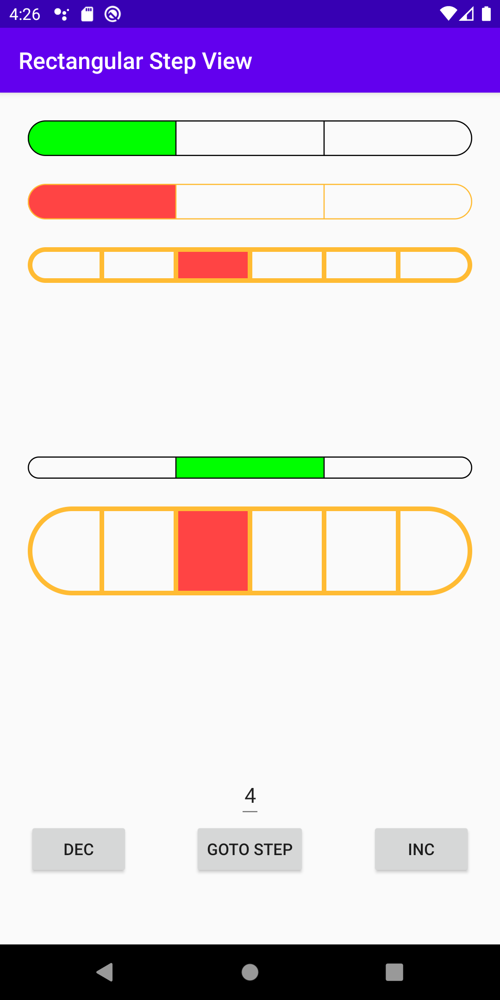

[](https://jitpack.io/#haytham-c01/RectangularStepView)
# Rectangular Step view
A highly customizeable step view, where you can change

1. inital step
2. current step
3. height & width
4. border color & size
5. active color

# Example


```

    <com.haytham.coder.stepview.RectangularStepView
        android:id="@+id/stepView1"
        android:layout_width="match_parent"
        android:layout_height="wrap_content"
        android:layout_marginBottom="24dp"/>

    <com.haytham.coder.stepview.RectangularStepView
        android:id="@+id/stepView2"
        android:layout_width="match_parent"
        android:layout_height="wrap_content"
        app:activeColor="@android:color/holo_red_light"
        app:borderColor="@android:color/holo_orange_light"
        android:layout_marginBottom="24dp"/>


    <com.haytham.coder.stepview.RectangularStepView
        android:id="@+id/stepView3"
        android:layout_width="match_parent"
        android:layout_height="wrap_content"
        app:activeColor="@android:color/holo_red_light"
        app:borderColor="@android:color/holo_orange_light"
        app:stepsCount="6"
        app:initialStep="2"
        app:stepViewStrokeWidth="4dp"
        android:layout_marginBottom="150dp" />


    <com.haytham.coder.stepview.RectangularStepView
        android:id="@+id/stepView4"
        android:layout_width="match_parent"
        android:layout_height="wrap_content"
        android:layout_marginBottom="24dp"
        app:initialStep="1"
        app:heightToWidthRatio="0.05"/>


    <com.haytham.coder.stepview.RectangularStepView
        android:id="@+id/stepView5"
        android:layout_width="match_parent"
        android:layout_height="wrap_content"
        app:activeColor="@android:color/holo_red_light"
        app:borderColor="@android:color/holo_orange_light"
        app:stepsCount="6"
        app:initialStep="2"
        app:stepViewStrokeWidth="4dp"
        app:heightToWidthRatio="0.20"
        android:layout_marginBottom="150dp" />
```
# Installation
1. Add maven to project-level gradle file
```
allprojects {
    repositories {
        google()
        jcenter()

        maven { url 'https://jitpack.io' }
    }
}
```
2. Add the dependency in your module-level gradle file
```
dependencies {
...
implementation 'com.github.haytham-c01:CurveView:LATEST_RELEASE'
}
```
# Attributes

| Name                       | Description                    | Type                             | Default Value |
| -------------------------- |--------------------------------| :------------------------------: | :-----------: |
| initialStep                | the default active step        |   integer [0 - (stepsCount-1)]   |  0            |
| stepsCount                 | number of steps in the view    |   integer [at least 2]           |  3            |
| borderColor                | color of view border           |   color                          |  Black        |
| activeColor                | color of the active step       |   color                          |  Green        |
| stepViewStrokeWidth        | width of the shape border      |   dimension [at least 0]         |  1dp          |
| heightToWidthRatio         | the percentage of view height <br>in respect to its width  |   float [0.01f - 0.2f]            |  0.08f        |

# Code Guide
#### 1- Increment by one step
```
stepView.incrementStep()
```
#### 2- Decrement by one step
```
stepView.decrementStep()
```
#### 3- Goto step
```
val stepNumber= 4
stepView.gotoStep(stepNumber)
```
#### 4- Listen to step changes
```
stepView.onStepChangedListener = {
    previousStep, currentStep ->
    // do something
 }
```

# License
```
Copyright 2013 Square, Inc.

Licensed under the Apache License, Version 2.0 (the "License");
you may not use this file except in compliance with the License.
You may obtain a copy of the License at

   http://www.apache.org/licenses/LICENSE-2.0

Unless required by applicable law or agreed to in writing, software
distributed under the License is distributed on an "AS IS" BASIS,
WITHOUT WARRANTIES OR CONDITIONS OF ANY KIND, either express or implied.
See the License for the specific language governing permissions and
limitations under the License.
```
